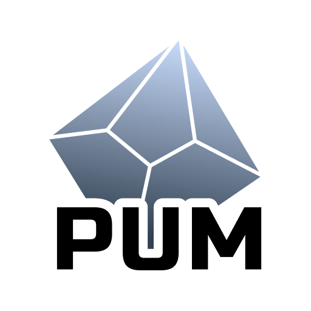
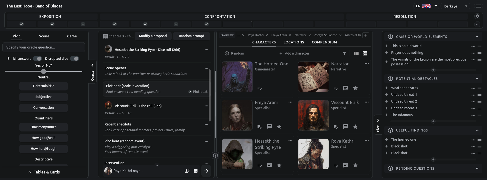

  

<h1 style="text-align: center;">PUM Companion Online Hub</h1>

  

  This is a knowledge base for <b>PUM Companion</b>—the app to play Plot Unfolding Machine. Here you’ll find everything you need to master solo RPGs, storytelling, and journaling with the app, whether you’re a curious beginner or a seasoned solo adventurer.

  <h2>Essential Links</h2>
  <ul style="list-style: none; margin: 0 auto; padding: 0; display: inline-block; text-align: left;">
    <li style="margin: 0; padding: 0;">💬 <a href="https://discord.gg/k2rQMa33Kq">Join the PUM Discord Community</a></li>
    <li style="margin: 0; padding: 0;">🐞 <a href="https://github.com/Unfolding-Machines/pumc-info-hub/issues">Feature Requests, Bugs, Inquiries</a></li>
    <li style="margin: 0; padding: 0;">🚀 <a href="https://github.com/Unfolding-Machines/pumc-info-hub">Improve the PUMC Online Hub on GitHub</a></li>
    <li style="margin: 0; padding: 0;">🌐 <a href="https://www.unfolding-machines.com">Unfolding Machines Website &amp; Blog</a></li>
  </ul>
  <h2>Navigation Index</h2>
  <h3>Plot Unfolding Machine</h3>
  <ul style="list-style: none; margin: 0 auto; padding: 0; display: inline-block; text-align: left;">
    <li style="margin: 0; padding: 0;"><a href="about-pum">About PUM</a></li>
    <li style="margin: 0; padding: 0;"><a href="game-concepts">Game Concepts</a></li>
    <li style="margin: 0; padding: 0;"><a href="oracles">Oracles</a></li>
    <li style="margin: 0; padding: 0;"><a href="plot-focus">Plot Focus</a></li>
    <li style="margin: 0; padding: 0;"><a href="plot-nodes">Plot Nodes</a></li>
    <li style="margin: 0; padding: 0;"><a href="plot-tracks">Plot Tracks</a></li>
  </ul>
  <h3>Take the most of the app</h3>
  <ul style="list-style: none; margin: 0 auto; padding: 0; display: inline-block; text-align: left;">
    <li style="margin: 0; padding: 0;"><a href="pum-companion">PUM Companion</a></li>
    <li style="margin: 0; padding: 0;"><a href="markdown-styling">Markdown Styling</a></li>
    <li style="margin: 0; padding: 0;"><a href="dice-formulas">Dice Formulas</a></li>
    <li style="margin: 0; padding: 0;"><a href="decks-cards">Decks &amp; Cards</a></li>
    <li style="margin: 0; padding: 0;"><a href="random-tables">Random Tables</a></li>
  </ul>

---

## Community & Contributions

This page has been setup for the PUM Companion community. Everyone is welcome to contribute improvements to it, so feel free to submit tips, random tables, hacks, and stories. If you have questions or suggestions, submit an issue ticket in  Github, join us on Discord, or submit a Pull Request contribution to the [GitHub repository](https://github.com/Unfolding-Machines/pumc-online-hub/).

**Happy storytelling!**

---

  

*PUM Companion is powered by the Plot, Scene, and Game Unfolding Machine games. Unfolding Machines @ Copyright 2024*
