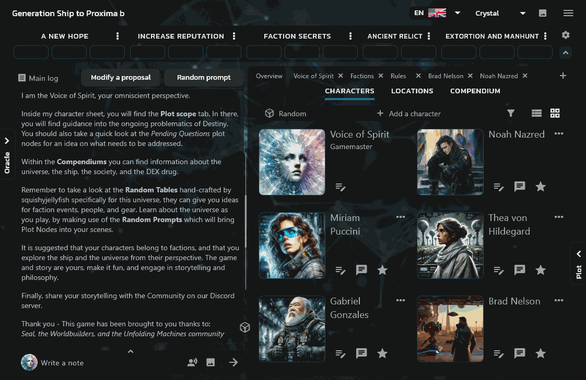

  

# Welcome to the PUM Companion Community Wiki

  This is your friendly, ever-growing knowledge base for <b>PUM Companion</b>—the app to play Plot Unfolding Machine. Here you’ll find everything you need to master solo RPGs, storytelling, and journaling, whether you’re a curious beginner or a seasoned solo adventurer.

  

---

## What is PUM Companion?

<b>PUM Companion</b> is a digital app and system for creating and playing your own adventures—solo or with friends. Inspired by tools like the Mythic GM Emulator, PUM blends improvisational storytelling, random prompts, and RPG mechanics for a unique experience every time.

**Key Features:**
- Story-driven or random gameplay
- Manage plot nodes, characters, and locations
- Use oracles, dice, random tables, and decks for inspiration
- Export and share your stories

  

---

## Explore the Wiki

Navigate through the sections below to learn, discover, and contribute:

- [About the Unfolding Machines](about-pum.md)

### How to Play PUM
  - [Quick-Start Guide](quick-start-guide.md)
  - [Plot Tracks](plot-tracks.md)
  - [Plot Nodes](plot-nodes.md)
  - [Plot Focus](plot-focus.md)
  - [Oracles](oracles.md)
  - [Game Concepts](game-concepts.md)

### PUM Companion
  - [Dice Formula Expressions](dice-formulas.md)
  - [Random Tables](random-tables.md)
  - [Decks & Cards](decks-cards.md)
  - [Markdown Text Styling](markdown-styling.md)

### Information
  - [Get the games](get-the-games.md)
  - [Resources & Downloads](resources.md)
  - [FAQ](faq-tips.md)

---

## Community & Contributions

This wiki is built by and for the community! Share your tips, random tables, hacks, and stories. If you have questions or suggestions, join us on Discord or contribute to the [GitHub repository](https://github.com/Unfolding-Machines/pumc-wiki-space/).

**Happy storytelling!**

---

  

*PUM Companion is powered by the Plot, Scene, and Game Unfolding Machine games. Unfolding Machines @ Copyright 2024*
